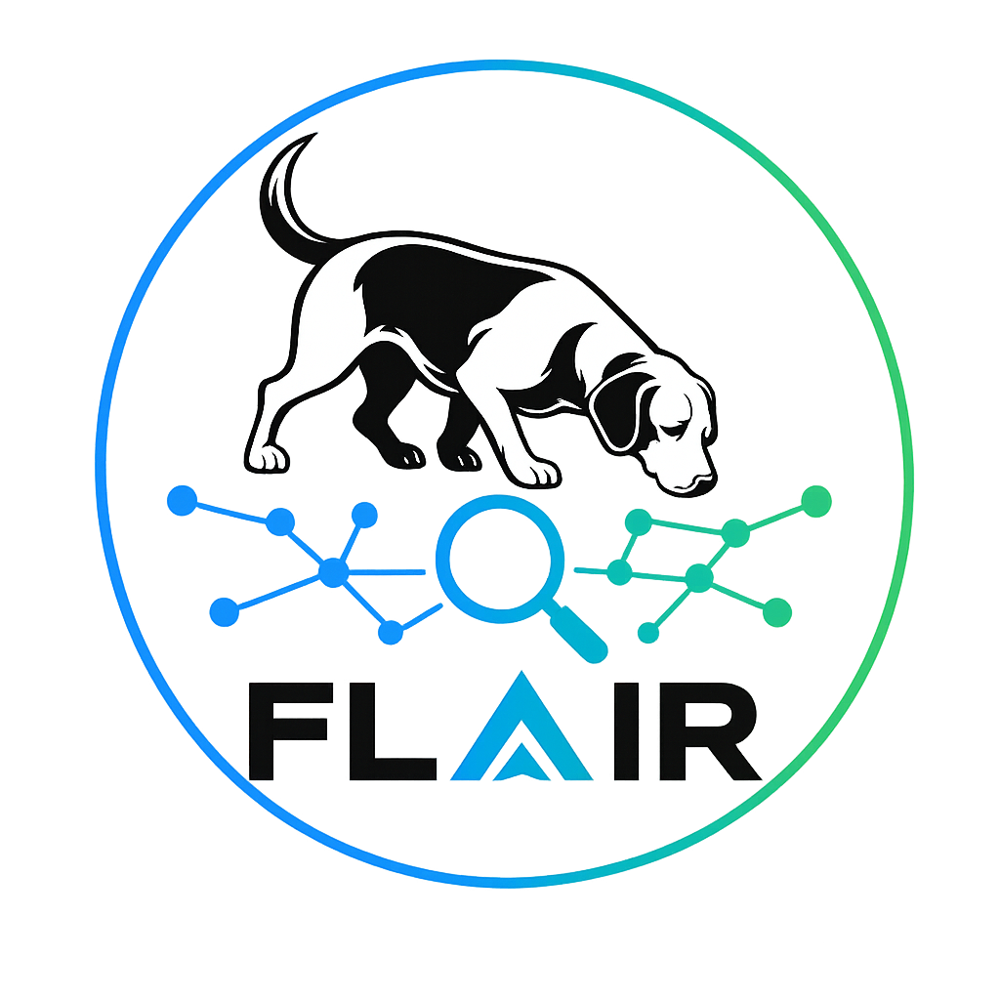
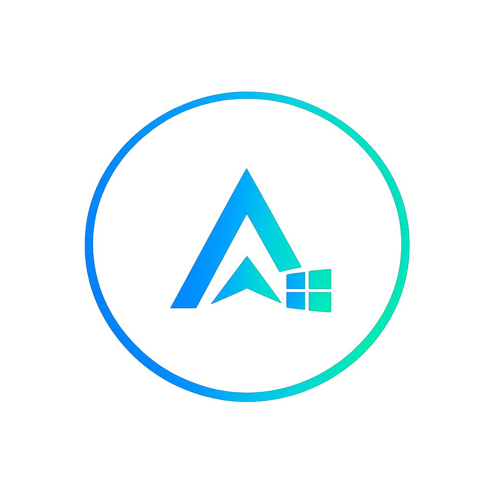
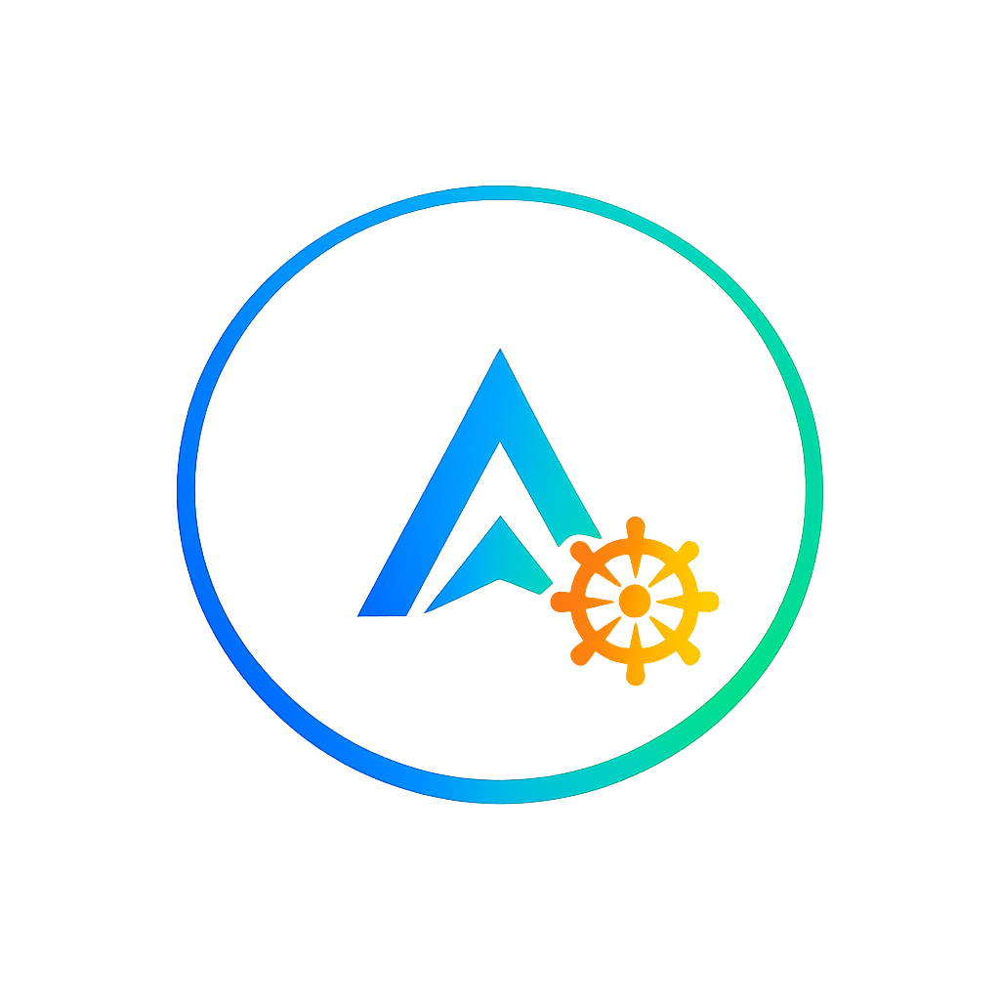
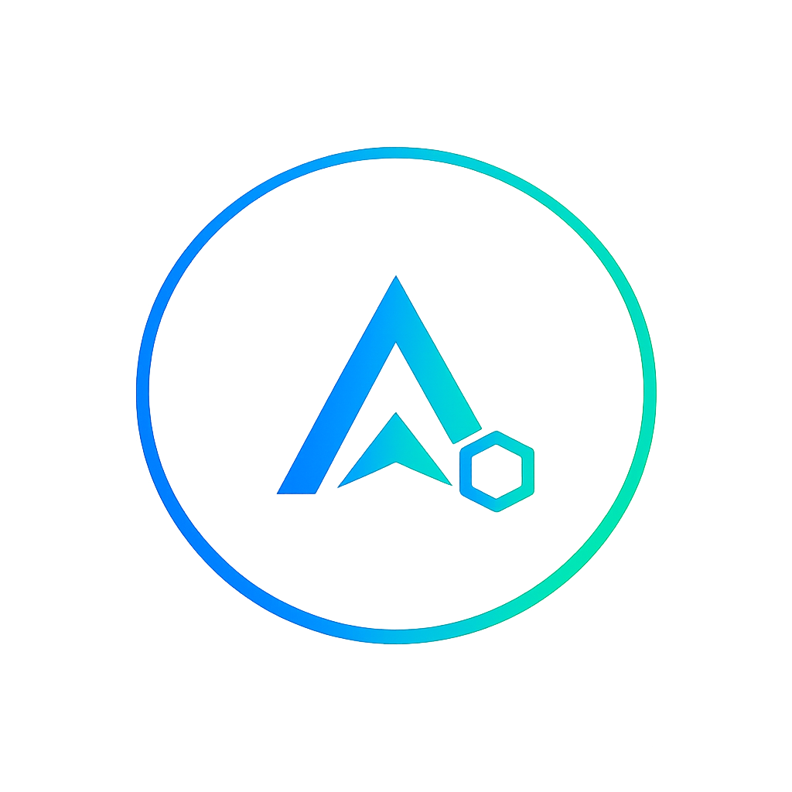
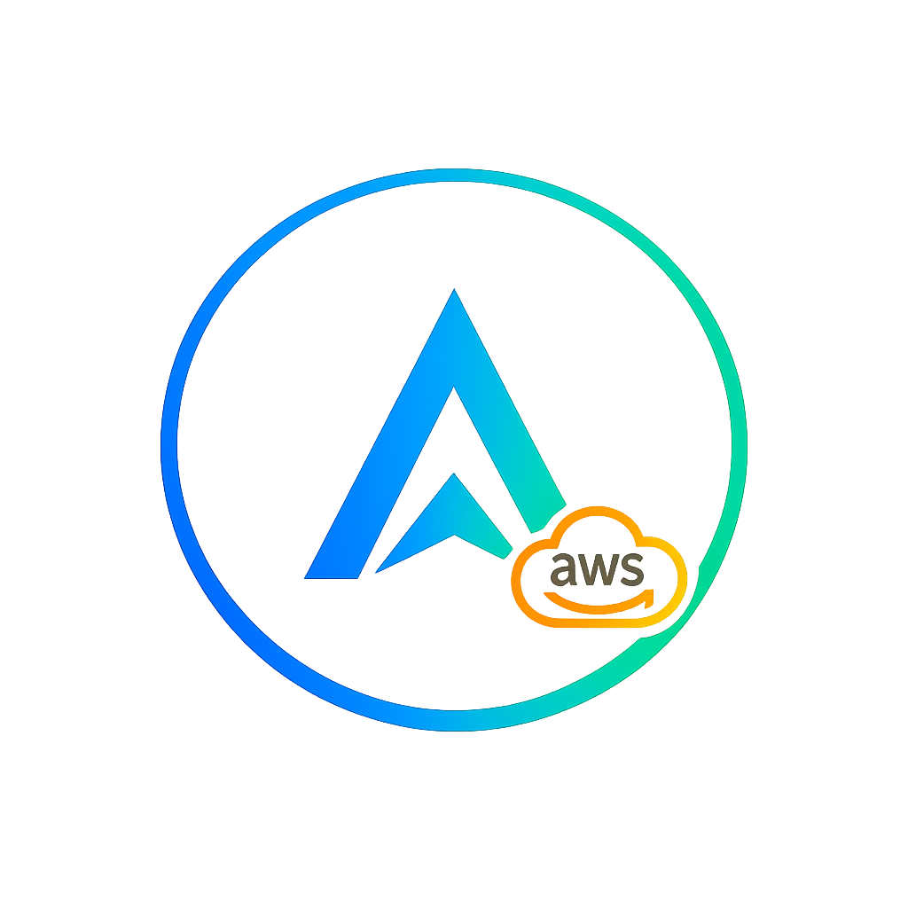
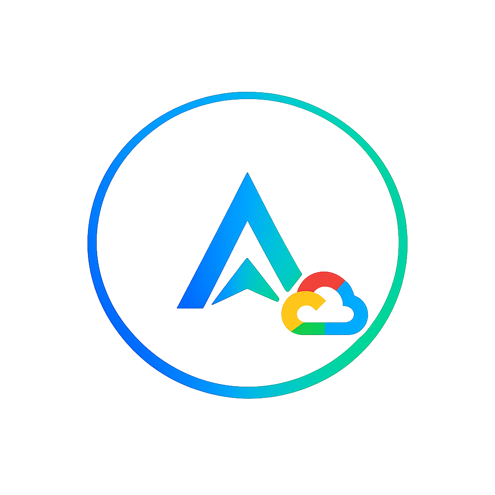
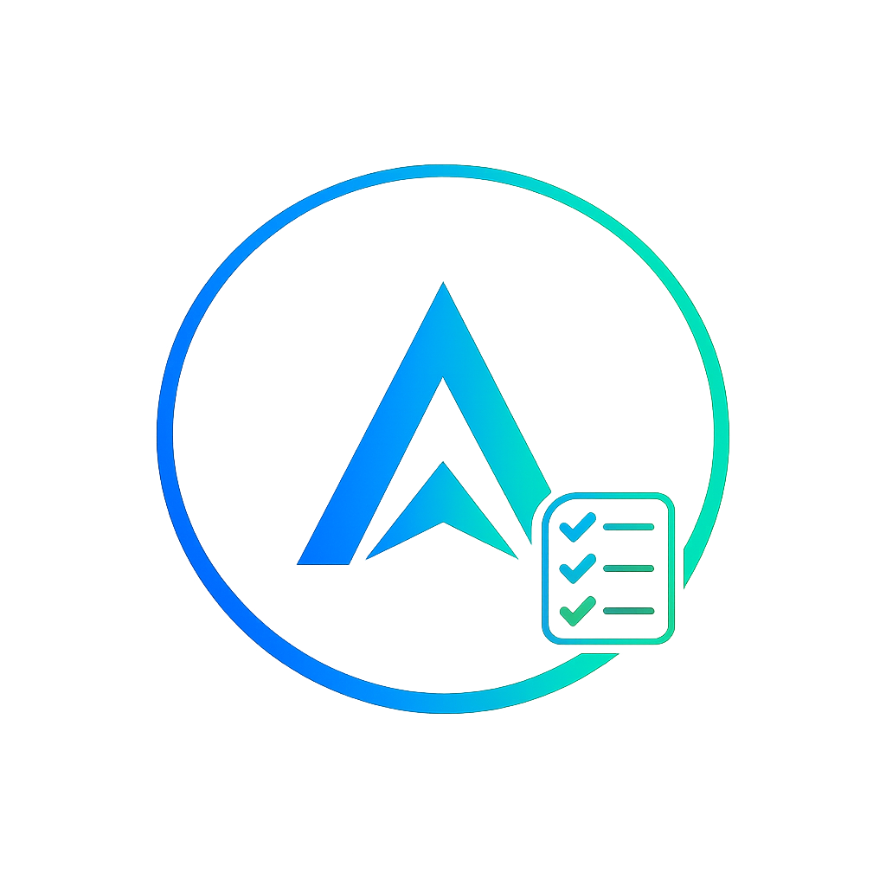
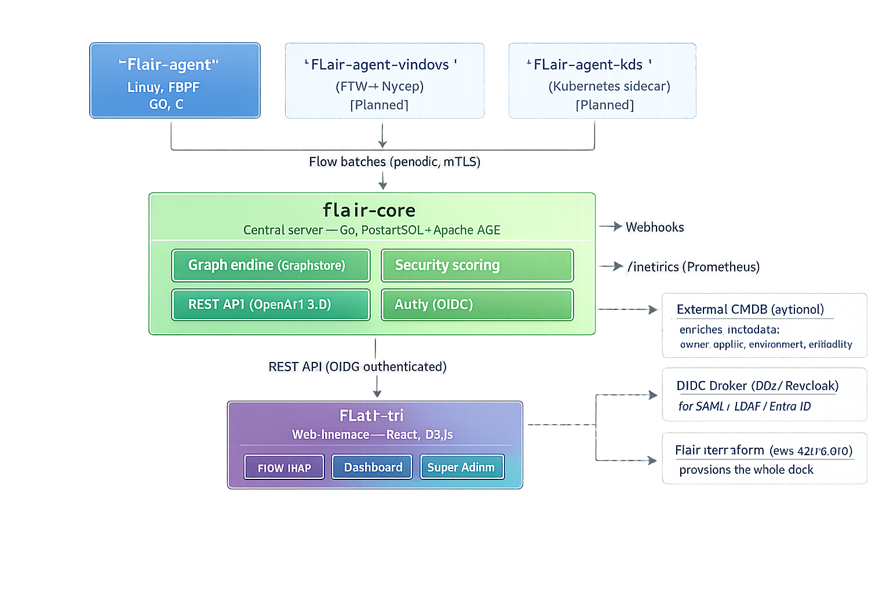

<div align="center">

<picture>
  
</picture>

# FLAIR

**Flow and Link Analysis with Inspection Report**

Open source security observability for application network flows.
See every flow. Expose every risk.

[](#license)
[](https://www.bestpractices.dev/)
[]()
[]()

</div>

---

## What is FLAIR?

Most security teams can't actually answer the question *"what talks to what, how, and is it safe?"* — not because they don't care, but because the tools that could tell them are scattered, expensive, or built for a different job entirely.

FLAIR is our attempt to fix that. It's a set of open source tools that automatically **map application flows**, **detect protocols**, and **fingerprint encryption levels** across your infrastructure — Linux, Windows, Kubernetes, on-prem or cloud — and turn all of that into something a security engineer or auditor can actually read and act on.

Think of it as a sniffer dog for your network: it finds the things everyone assumes are fine but nobody has actually checked — the unencrypted flow between two services that "definitely use TLS", the database connection still running on a deprecated cipher, the integration that crosses into the DMZ nobody remembers approving.

---

## Why we're building this

If you've ever tried to answer "is everything encrypted between our services?" honestly, you know the answer usually involves Slack messages, tribal knowledge, and a shared spreadsheet that's six months out of date.

The tools that exist today cover pieces of this:

- Network observability tools (Cilium Hubble, Zeek) see the traffic but don't speak "security risk"
- Packet inspection tools (Packetbeat) collect rich data but need a heavy stack (Elastic) behind them and don't build a security-qualified map
- Kubernetes-native tools work great — until you have a VM, a bare-metal server, or a Windows host in the mix

Meanwhile, regulations like **NIS2**, **DORA** and **ISO 27001** increasingly *require* this kind of mapping as part of risk management and audit evidence. FLAIR exists to make that mapping continuous, automatic, and genuinely useful — not a once-a-year spreadsheet exercise.

---

## The ecosystem

FLAIR is split into focused repositories. Each one does one thing, has its own release cycle, and (where it makes sense) its own license — more on that below.

### Core

| | Repository | What it does | Status | Stack | License |
|:---:|:-----------|:-------------|:-------|:------|:--------|
|  | [`flair-agent`](https://github.com/flair-sec/flair-agent) | eBPF-based agent for Linux — captures flows, detects protocols, fingerprints TLS (JA3) | 🚧 MVP in progress | Go, eBPF (cilium/ebpf), C | GPL v3 |
|  | [`flair-core`](https://github.com/flair-sec/flair-core) | Central server — flow graph, security scoring, REST API, webhooks, auth | 🚧 MVP in progress | Go, PostgreSQL + Apache AGE | GPL v3 |
|  | [`flair-ui`](https://github.com/flair-sec/flair-ui) | Web interface — interactive flow map for RSSIs and auditors | 🚧 MVP in progress | React, D3.js, TypeScript | Apache 2.0 |

### Platform reach

| | Repository | What it does | Status | Stack | License |
|:---:|:-----------|:-------------|:-------|:------|:--------|
|  | [`flair-agent-windows`](https://github.com/flair-sec/flair-agent-windows) | Windows agent (ETW + Npcap) — same flow data contract as the Linux agent | 💡 Future | Go, ETW, Npcap | GPL v3 |
|  | [`flair-helm`](https://github.com/flair-sec/flair-helm) | Official Helm chart — agent as DaemonSet, core server, ingress, one command | 📋 Planned | Helm, Kubernetes YAML | Apache 2.0 |
|  | [`flair-agent-k8s`](https://github.com/flair-sec/flair-agent-k8s) | Kubernetes-native sidecar variant of the agent | 💡 Future | Go, eBPF | GPL v3 |

### Cloud deployment

| | Repository | What it does | Status | Stack | License |
|:---:|:-----------|:-------------|:-------|:------|:--------|
|  | [`flair-terraform-aws`](https://github.com/flair-sec/flair-terraform-aws) | Terraform modules to provision FLAIR on AWS | 💡 Future | Terraform (HCL) | Apache 2.0 |
|  | [`flair-terraform-azure`](https://github.com/flair-sec/flair-terraform-azure) | Terraform modules to provision FLAIR on Azure | 💡 Future | Terraform (HCL) | Apache 2.0 |
|  | [`flair-terraform-gcp`](https://github.com/flair-sec/flair-terraform-gcp) | Terraform modules to provision FLAIR on GCP | 💡 Future | Terraform (HCL) | Apache 2.0 |


### Integrations & community

| | Repository | What it does | Status | Stack | License |
|:---:|:-----------|:-------------|:-------|:------|:--------|
|  | [`flair-sdk-go`](https://github.com/flair-sec/flair-sdk-go) | Go client for the `flair-core` API | 💡 Future | Go | Apache 2.0 |
|  | [`flair-sdk-python`](https://github.com/flair-sec/flair-sdk-python) | Python client for the `flair-core` API | 💡 Future | Python | Apache 2.0 |
|  | [`flair-rules`](https://github.com/flair-sec/flair-rules) | Community-maintained detection & scoring rules | 💡 Future | YAML | CC0 |
|  | [`flair-docs`](https://github.com/flair-sec/flair-docs) | Documentation — architecture, deployment, API reference | 📋 Planned | Docusaurus / Markdown | CC BY 4.0 |

**Legend:** 🚧 active development · 📋 planned, not started yet · 💡 on the roadmap, not scoped in detail

We'd rather have a handful of repos that are genuinely maintained than a long list that looks impressive and goes stale. New repos get created when there's real work ready to start, not before.

---

## How it fits together

<div align="center">



</div>

The agents — whatever the OS or platform — all speak the same flow data contract to `flair-core`. That's the part we protect most carefully: if it breaks, everything downstream breaks with it.

---

## Where things stand today

We're early. The MVP is `flair-agent` (Linux/eBPF) + `flair-core` + `flair-ui`, focused on proving the core idea: a flow map that tells you, at a glance, what's encrypted, what isn't, and what crosses a security boundary it shouldn't.

Windows support, Kubernetes-native deployment, multi-cloud provisioning, SDKs, and a queue-based ingestion path for large fleets are all real plans — they're just sequenced after the core works well on its own. We'd rather ship something solid on Linux first than something half-working everywhere.

---

## Security & compliance posture

We're building FLAIR the way we'd want a security tool to be built — which means holding ourselves to the standards we're asking other tools to meet:

- **mTLS** between agents and `flair-core` — there's no insecure mode, by design, not even for testing
- **Non-root agents** — only the Linux capabilities they actually need (`CAP_NET_ADMIN`, `CAP_SYS_PTRACE`), documented explicitly
- **Structured audit logs** (JSON to stdout) for every API action
- **OpenSSF Best Practices badge** — questionnaire in progress, aiming for *passing* as a first milestone
- **Signed releases** (GPG) — planned for the first stable release
- **Lightweight CLA** via GitHub CLA Assistant, so the project can evolve its licensing if needed without chasing down every past contributor

If you find a security issue, please don't open a public issue — check the `SECURITY.md` in the relevant repo for a private disclosure process.

---

## License

FLAIR uses a mix of licenses depending on what each repository is for:

- **GPL v3** (with an explicit internal-use exception) for the agents and the core engine — the parts that represent the real engineering investment, and that we want to stay open if someone builds on them. Using FLAIR inside your organization, without redistributing it, never triggers copyleft obligations.
- **Apache 2.0** for the UI, Helm charts, Terraform modules and SDKs — the parts meant to be embedded, forked, and integrated freely, including in proprietary tooling.
- **CC0** for community detection rules, and **CC BY 4.0** for documentation.

Each repository's `LICENSE` file is authoritative for that repository.

---

## Contributing

We'd genuinely love your help — whether that's code, docs, detection rules, bug reports, or just telling us we got something wrong.

Start with the `CONTRIBUTING.md` in whichever repo interests you. `flair-agent` (eBPF/kernel-level Go and C) has the steepest learning curve. `flair-ui`, `flair-docs` and `flair-rules` are great places to start if you're newer to the project — or to systems programming in general.

---

## Context for AI coding assistants

> This section is the shared context for AI-assisted development across the FLAIR ecosystem (Claude Code, GitHub Copilot, etc.). Each repository has its own `CLAUDE.md` with repo-specific build commands and conventions — **this document is for understanding how the pieces fit together**, and should be read first when a task spans more than one repository.

### Project identity

- **Name:** FLAIR — Flow and Link Analysis with Inspection Report
- **Mission:** map application network flows, detect protocols, fingerprint TLS encryption, and surface security risk — for security engineers, RSSIs and auditors
- **Primary users:** people who need to *trust* the output without being networking experts — favor clarity over cleverness in UI text and error messages
- **Platform scope:** Linux first (current focus), with Windows, Kubernetes and multi-cloud as explicitly planned extensions — see the ecosystem table above for what's active vs. planned
- **Deployment model:** self-hosted, single-tenant per organization. There is no SaaS multi-tenancy — one `flair-core` instance belongs to one organization and aggregates all of that organization's infrastructure (production, staging, dev, whatever environments they have)

### Repository responsibilities — keep these boundaries clean

- **`flair-agent`** (and its future siblings `flair-agent-windows`, `flair-agent-k8s`) own flow capture, protocol detection, and TLS fingerprinting. They emit `Flow` structs in periodic batches and nothing else — no scoring logic, no UI concerns. Keep agents dependency-light: target <20MB binary, <0.5% idle CPU.
- **`flair-core`** owns the flow graph, security scoring, persistence, authentication, REST API (OpenAPI 3.0 via swaggo), webhooks, and `/metrics`. It receives `Flow` batches from any agent — it shouldn't need to know or care which OS or platform produced them.
- **`flair-ui`** owns visualization and the super-admin area: the flow graph (zones, cross-zone highlighting, protocol/port labels, encryption colors), dashboards, alerts, environment/metadata filters, retention settings, user and role management. It talks to `flair-core`'s REST API exclusively — never directly to an agent.
- **`flair-helm`** and the **`flair-terraform-*`** repos own deployment/infrastructure only — no application logic lives there.
- **`flair-sdk-go`** / **`flair-sdk-python`** are thin clients over the `flair-core` API — they should track the API, not add behavior of their own.

### The shared contract: the `Flow` object

This is what every agent — regardless of OS — sends to `flair-core`, batched periodically rather than streamed event-by-event. It's the single most important interface in the whole ecosystem. Any change here is a breaking change across multiple repos and needs explicit versioning.

```go
type Flow struct {
    SrcIP       string
    SrcPort     int
    DstIP       string
    DstPort     int
    Protocol    string            // "HTTP/1.1", "gRPC", "SQL", "AMQP", "Redis", ...
    TLSVersion  string            // "TLS1.3", "TLS1.2", "" (none)
    Encrypted   bool
    SrcProcess  string
    SrcPID      int
    Timestamp   time.Time
    Metadata    map[string]string // extensible: "environment", "owner",
                                   // "app_id", "criticality" — populated
                                   // manually or via CMDB enrichment
}
```

`Metadata` is deliberately open-ended. Things like **environment** (production/staging/dev), **owner** (team name), **app_id**, and **criticality** are not first-class fields with their own columns — they're metadata, populated manually at first and later enriched automatically by a CMDB connector. Don't add dedicated schema columns for concepts that belong here; extend `Metadata` instead.

If you're working on `flair-agent-windows` or `flair-agent-k8s`, the goal is always to populate this same struct — even if the underlying capture mechanism (ETW, sidecar, eBPF) is completely different.

### Key interfaces — abstract these from day one

These three interfaces are the seams where FLAIR is expected to grow. The MVP implementation can be simple, but the *interface* must exist so the simple implementation can be swapped without rewriting calling code.

**`GraphStore`** — persistence and graph queries.
- MVP / dev: SQLite
- Target for v1 enterprise: **PostgreSQL + Apache AGE** (one engine for relational data — users, config, audit logs — and graph traversal via Cypher)
- Calling code (scoring, API handlers) talks to `GraphStore`, never to `database/sql` or AGE-specific queries directly

**`AuthProvider`** — user authentication for `flair-ui`.
- MVP: local users (username/password)
- Primary target: **OIDC client** (`coreos/go-oidc`) — OIDC is the majority protocol for enterprise IdPs today (Entra ID, Okta, Google Workspace)
- SAML/LDAP/legacy Active Directory: **not implemented in `flair-core`**. Document that organizations should front `flair-core` with an OIDC broker (Dex, Keycloak, Authentik) if they need SAML — `flair-docs` provides a reference `docker-compose` with Dex for this
- SCIM (automated user provisioning/deprovisioning from the IdP) is a planned `AuthProvider`-adjacent feature, out of scope for MVP

**`IngestQueue`** — how `flair-core` receives `Flow` batches from agents.
- MVP: agents POST batches directly to a `flair-core` ingestion endpoint, written to `GraphStore` synchronously
- At scale (large fleets): a message queue (NATS is the leading candidate) sits between agents and `flair-core`, decoupling ingestion rate from write throughput
- This is explicitly **not a near-term priority** — the interface should exist so the swap is mechanical when the need arises, but don't over-engineer it now

### Agent enrollment

New agents authenticate to `flair-core` for the first time using a **single-use enrollment token with a short TTL** (generated in the `flair-ui` super-admin area, similar to `kubeadm join` tokens). The agent exchanges this token once for a permanent mTLS client certificate. After that, the token is invalid.

This applies to `flair-agent`, `flair-agent-windows`, and `flair-agent-k8s` alike. For `flair-terraform-*`-provisioned agents, cloud-native identity (AWS IAM roles, Azure Managed Identity, GCP service accounts) as an alternative to manual tokens is a reasonable future enhancement — not required for MVP.

### Scoring & color conventions — consistent everywhere

- 🟢 **Green / "ok"** — TLS 1.3, score ≥ 70
- 🟠 **Amber / "warn"** — TLS 1.2 or a deprecated protocol, score 30–69
- 🔴 **Red / "danger"** — unencrypted, score < 30
- 🔵 **Blue / "info"** — neutral/informational (e.g. internal gRPC, not yet scored)

A flow that **crosses a network zone boundary** is flagged `cross_zone: true` regardless of its score, and `flair-ui` should always make these visually obvious — they're usually where the real risk is. "Zone" itself is just another `Metadata` value (e.g. `"DMZ"`, `"INTERNAL"`, `"DATA"`) — the crossing logic compares two flows' zone metadata, it doesn't require a dedicated schema concept.

### Non-negotiables across the ecosystem

- No `--tls-verify=false`-style escape hatches, anywhere, ever
- Every `flair-core` API action produces a structured JSON audit log line
- The default install works without Kubernetes, without Elasticsearch, and without calling out to third-party services — self-hosted by design
- Retention policy (how long raw flow data is kept before aggregation/purge) is **configurable by admins via `flair-ui`**, not hardcoded — this matters for both storage cost and GDPR (flows contain IP addresses)
- When a task touches the `Flow` contract or one of the three key interfaces, update in dependency order: agent (producer) → `flair-core` (`GraphStore`/`IngestQueue`/consumer) → `flair-ui` (display/admin) — and call out cross-repo impact explicitly

---

<div align="center">

**[flair-sec.io](https://flair-sec.io)** · made with 🐾 for the people who actually have to answer "is this encrypted?"

</div>
